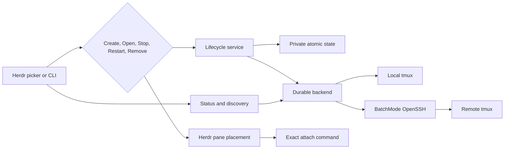

# Architecture and security

Tether makes a terminal workload outlive any one Herdr view or SSH connection. Herdr owns panes and tabs, `tmux` owns durable execution, OpenSSH owns remote transport, and Tether owns exact workload identity plus lifecycle metadata.

The public mental model is documented in [Lifecycle](lifecycle.md). This document describes the implementation and trust boundaries behind it.

## System overview

The boundaries are intentionally one-way:

- status and discovery may observe, but cannot authorize destructive work;
- Herdr placement may display or attach, but cannot change workload ownership;
- external session discovery produces an attach-only type with no lifecycle methods;
- metadata cleanup has no SSH, `tmux`, probe, or Stop capability.

## Core invariants

1. Closing or losing a view never stops a workload.
2. Only an explicit confirmed Stop may end a running Tether-owned workload.
3. Open attaches only to an exact workload proven running.
4. Ended work is never offered as a running attachment; Restart creates a safe new identity from retained launch data.
5. Remove and automatic cleanup affect only metadata already proven safe to finalize.
6. Unknown or unreachable is not treated as dead.
7. External `tmux` sessions are validated, exact-name, attach-only resources.
8. Mutating configuration and state migrations occur under the same private lock and atomic-write rules as ordinary mutations; snapshot observation migrates legacy data in memory without rewriting its files.

## Opt-in orchestration groups

Development state schema version 4 stores an `orchestration_groups` collection
and a unique membership epoch for every worker entry. Stable schema versions
migrate with an empty collection, so no session is grouped implicitly.
Development schema version 3 groups migrate by assigning and persisting fresh
membership epochs. Each group stores a bounded, harness-neutral ID and title,
one exact orchestrator session reference, and an ordered worker-membership
list. Each worker stores its opaque epoch, an exact session reference, an
optional display title, and two independent capabilities:

- `observe_output` authorizes bounded, read-only output capture; and
- `open_interactive` authorizes opening that worker from Observer.

A worker must have at least one capability. The orchestrator reference records
the coordinating role but does not grant lifecycle or capture authority.
Creating or deleting a group and adding or removing a worker mutate only group
metadata: they never create, adopt, stop, remove, or send input to a session.
State admits at most 32 groups and 64 workers per group. Identifiers and titles
are validated and bounded; references carry no host, path, command, or
orchestration-runtime assumptions.

The native picker exposes groups through a harness-neutral manager projection.
It derives bounded labels from safe host, repository, and preset metadata,
persists create/edit/delete requests through `OrchestrationService`,
and re-reads authoritative state after each mutation. UI defaults grant both
bounded observation and interactive open to selected workers. The manager never
renders full raw session IDs: only ambiguous safe labels receive bounded opaque
collision references. It never calls workload lifecycle methods. The standalone
CLI uses the same service and remains an optional adapter API.
Every new orchestrator or worker admission revalidates that session as a
currently running exact-owned workload while holding the state lock, including
optional CLI adapter operations. Manager edits permit already-retained
unavailable members. Worker-edit, reassignment, and delete actions carry the
complete topology snapshot displayed to the user and reject under the lock if
its title, orchestrator, membership order, membership epoch, capabilities, or
worker titles changed before commit. Promoting a worker to orchestrator removes
that worker role while preserving every unaffected membership.

## Observer projection

`orchestration observe` creates exactly one outer Herdr pane. Inside that pane,
Observer projects the selected group's current workers into at most four
read-only tiles per page. Layout is deterministic and row-major: one tile uses
the full canvas, two divide it side by side, and three or four use a 2×2 grid.
Additional workers remain in membership order on deterministic pages; the
footer reports overflow. The persisted 64-worker limit also bounds projection
work.
When the available geometry cannot fit useful bordered tiles, Observer renders
one bounded resize message instead of subdividing the pane. Observer chrome
uses terminal-default foreground and background colors; untrusted captured
output remains sanitized rather than interpreting its color escapes.

Observer reloads group and session metadata while it runs, so membership,
selection, and lifecycle labels follow state changes without creating one Herdr
pane per worker. Labels distinguish `STARTING`, `RUNNING`, `STOPPING`, `ENDED`,
`MISSING`, `REMOVED`, and `UNKNOWN`; stopping is never reported as ended.
Deleting the observed group ends refresh with an explicit
error rather than retaining a stale authority view.

Capture requires all of the following at refresh time: the exact persisted
membership epoch, `observe_output`, running status, and a Tether record with
both ownership proof and exact internal `tmux` identity. Tether captures only
the visible page, checks the same complete authorization fingerprint again
after each asynchronous capture, and rejects results if membership,
capabilities, session identity, ownership proof, or internal `tmux` identity
changed while capture was in flight. Each request reads at most the recent 200
joined lines. Rendering strips terminal escape sequences and unsafe formatting
and caps each capture at 200 logical lines, 16 KiB, and 16,384 display cells.
Capture failure is shown as unavailable; it does not broaden the target or make
the worker interactive. Observer has no worker-input path.

`Enter` is a separate, capability-checked transition. It succeeds only when the
selected member still has `open_interactive` and still resolves to a running
exact-owned session. Tether then opens it through the ordinary lifecycle and
Herdr placement boundary while Observer remains available. Both the outer
Observer launch and an interactive worker open normalize configured or explicit
`replace-current-pane` to `split-right`, preserving the companion/source pane.
Observer debounces repeated opens of the same selected worker after one
placement completes, so queued `Enter` presses cannot fan out duplicate panes.
This gate is local to Observer and does not change ordinary intentional
multi-attachment elsewhere. Companion placement creates and runs only the
destination pane; it does not run a command in or close the source launcher
pane.
Native manager launch also requires a valid
`HERDR_PLUGIN_CONTEXT_JSON.focused_pane_id`; it fails before placement rather
than treating the managed picker overlay as the source. The optional standalone
adapter path retains its generic Herdr environment compatibility.
Observer terminal teardown independently attempts to restore cursor visibility,
leave the alternate screen, and disable raw mode on every guarded exit path;
one restoration error cannot prevent the remaining attempts.

The outer `observe` launch itself requires an invoking Herdr pane context.
Processes nested inside a Tether `tmux` workload must not assume that Herdr's
plugin environment is inherited; they must request or hand off an explicit
launch from a Herdr pane. This keeps pane placement authority at the Herdr
boundary and prevents a harness adapter from becoming a runtime dependency.

## Durable workload backend

`DurableBackend` is transport-independent. Its implementation creates, observes, attaches to, and stops exact Tether-owned workloads. `TmuxBackend` supplies local and SSH-backed behavior without knowing about Herdr panes or picker state.

Local operations preserve argv. Remote operations build a POSIX-quoted remote `tmux` command and pass it to OpenSSH after `--`. Every remote operation uses `BatchMode=yes`; Tether does not weaken strict host-key verification or replace OpenSSH configuration.

Creation:

1. generates a reserved Tether identity;
2. starts a detached `tmux` session in the selected directory;
3. captures `tmux`'s internal session and pane identities;
4. verifies the pane's exact working directory (or same directory inode);
5. enables mouse support only on the exact owned session; and
6. records metadata only after backend creation succeeds.

A verification or persistence failure triggers best-effort rollback through the captured internal identity. If rollback also fails, the error identifies the exact workload that may remain without exposing command output.

Literal remote `~` and `~/...` paths expand in the remote login environment before directory restoration and verification. The selected command then runs as trusted code through the selected machine's shell.

## Observation and ended processes

Tether makes one bounded, non-destructive catalog observation per host and derives both owned and external rows from it. Probes have deadlines, output caps, cancellation, and child-process-group cleanup. One slow host does not block completed hosts.

For owned work, observation prefers native `tmux` evidence such as `remain-on-exit`, `pane_dead`, and pane exit status when supported. This distinguishes:

- a process that is still running;
- a process that ended with available exit context;
- an exact identity proven missing; and
- an observation that is unreachable or structurally unknown.

Missing and ended identities are not attachable. Cached picker status is display data only; Stop, Restart, and Remove revalidate the authoritative record and the evidence required by their operation.

External catalog rows are validated printable names outside the reserved `tether-*` namespace. They can produce an exact attach command, but no external type can be converted into a create, persist, rename, Stop, Remove, or cleanup request.

## Lifecycle transactions

### Create

Tether creates the backend workload before recording it as running. If state persistence fails, it attempts exact rollback. Placement failure also rolls back a newly created workload and metadata so retry cannot silently duplicate it.

### Open

Open loads the exact persisted host and identity, observes it, and attaches only when it is running. It updates use metadata atomically before launching the attach client. A later attach or placement failure leaves the workload untouched.

### Stop

Stop is explicit and confirmed. Tether observes the exact owned identity without holding the state-file lock, revalidates the unchanged record under a short lock, and persists a recoverable stopping transition before invoking exact backend termination. It finalizes the record only after the workload is proven missing or the exact Stop succeeds.

Timeout, transport failure, save failure, or concurrent change never masquerades as success. A persisted stopping transition can be reconciled after interruption.

### Restart

Restart is available only for an ended or proven-missing owned record. It retains the original command and directory, allocates a safe new execution identity, and commits the identity/state transition atomically. Persistence, transport, or placement failure remains recoverable and does not expose the old ended identity as running.

### Remove and retention

Remove finalizes metadata only for ended or proven-missing work. Automatic retention cleanup removes only safely finalized metadata after the configured period. Cleanup does not construct a backend and cannot contact a host or stop a process.

When a cleanup operation works from a preview, it revalidates the exact unchanged candidate set under one lock. It never expands to records that became eligible after the preview began.

## Persistence

`ConfigStore` owns validated TOML. `StateStore` owns lifecycle records. Their parent directories, persistent lock files, data, and temporary files use private Unix permissions. Mutations hold a per-file advisory lock across load, validation, migration, mutation, and save.

The atomic writer:

1. writes a unique sibling temporary file;
2. synchronizes its contents;
3. atomically renames it over the destination; and
4. synchronizes the parent directory.

Supported older schemas migrate inside the lock. Corrupt data, unknown fields where strict schemas apply, and future versions fail closed. State is metadata, not a process registry; destructive safety comes from fresh exact backend evidence, not the presence or absence of a JSON record.

Stored data may include host targets, directories, trusted preset commands, owned identifiers, launch information, lifecycle status, exit context, and timestamps. Tether does not store SSH passwords, private keys, access tokens, terminal contents, or telemetry identifiers.

## Discovery and snapshots

Repository discovery is bounded by configured roots, depth, entries, results, workers, and time. Local traversal does not follow symlinks. Remote traversal uses a fixed portable scanner through validated BatchMode SSH. Results are presentation data and never rewrite configured roots or lifecycle state.

The scriptable snapshot joins effective hosts, bounded repository discovery, complete owned metadata, live owned status, and safe external catalogs. Expected degradation is represented as typed partial data instead of a fabricated empty result. Snapshot has no lifecycle or persistence-mutation capability and excludes preset command bodies, child output, raw backend errors, and private storage paths.

## Herdr placement boundary

`HerdrClient` adapts Herdr's pane and tab commands. It captures the invoking pane, creates and focuses the selected split or tab, then runs an exact Tether attach command there. Tether uses its resolved executable and forwards Herdr's authoritative plugin config/state directories instead of relying on a pane-local `PATH`.

Replace current pane follows destination-first ordering:

1. inspect foreground processes in the captured source;
2. request confirmation when replacement could terminate them;
3. create a destination;
4. dispatch the exact attachment;
5. wait for the strongest readiness signal Herdr exposes; and
6. only then close the captured source.

Cancellation, dispatch failure, or readiness failure preserves the source. A final source-close failure preserves the verified destination and reports both pane identities.

Herdr 0.7.3 has no general nested-workload registration API. Tether cannot infer the native agent identity or lifecycle of an arbitrary process behind SSH and `tmux`, so it uses clear pane/session titles instead of fabricating sidebar agents.

## Threat model and trust boundary

The trusted computing base includes:

- the local user account and filesystem;
- installed Tether, Herdr, Git, Rust/Cargo, `ssh`, `tmux`, and `/bin/sh` executables;
- Tether configuration and command presets;
- OpenSSH configuration, keys, agent, proxies, and `known_hosts`; and
- each selected remote host and user account.

Tether does not sandbox commands, secure a compromised endpoint, configure SSH trust, rotate credentials, or replace host authorization. It does:

- validate SSH targets and external session names;
- preserve argv and quote only at unavoidable command-line boundaries;
- use exact owned `tmux` identities for lifecycle actions;
- reserve its ownership namespace;
- bound probes and scanners;
- keep lifecycle transitions recoverable;
- use private atomic persistence; and
- keep destructive capability out of observation, external attachment, and cleanup paths.

For operational settings, see [Configuration](configuration.md). Report suspected vulnerabilities through the [security policy](../SECURITY.md).
