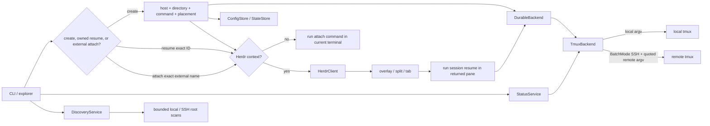

# Tether architecture

## Purpose and invariants

Tether makes the lifetime of a terminal workload independent of the Herdr pane or SSH connection viewing it. In v0.2.1 the durable unit is one exactly named `tmux` session. A pane is an attach client, not the workload owner.

The implementation preserves these invariants:

1. creating a workload precedes recording it as active;
2. a persistence failure after create triggers a best-effort close; if rollback also fails, the exact workload ID and both failures are reported;
3. attach/resume never closes a workload, including when attach fails or the connection drops;
4. only explicit close may invoke `kill-session`; before killing a running workload it persists a recoverable `closing` marker, then finalizes metadata only after the workload is proven missing or exact-session kill succeeds;
5. config and state mutations hold per-file advisory locks across load, mutation, and atomic save;
6. pruning removes only old closed metadata and never kills or probes workloads;
7. every attachment uses an exact tmux target derived from either an owned `SessionId` or a validated non-Tether external name;
8. external sessions are cataloged and attached only; their type has no create, persist, rename, close, kill, or prune operation.

Remote support is ordinary OpenSSH transport to remote `tmux`. It is not native remote Herdr federation.

## Runtime flow



For `open`, the CLI resolves hosts before creating or loading state when an explicit host was supplied. A fully specified create request bypasses the explorer. Otherwise, the explorer returns one of three typed intents: create obtains directory, command, and placement before creating and atomically recording a workload; owned resume carries an active record's exact `SessionId`; external attach carries the current host target and a validated non-Tether name. In Herdr context, create/owned paths place `session resume <ID>` while external paths place the hidden, attach-only `session attach-external --target … -- <name>` command. Outside Herdr, attachment runs in the current terminal.

## Actual boundaries

### `DurableBackend`

`src/backend.rs` defines the transport-independent lifecycle contract:

```rust
trait DurableBackend {
    fn create(&self, launch: &LaunchSpec) -> Result<()>;
    fn inspect(&self, id: &SessionId) -> Result<WorkloadState>;
    fn attach_command(&self, id: &SessionId) -> Result<CommandSpec>;
    fn close(&self, id: &SessionId) -> Result<()>;
}
```

`LaunchSpec` carries the generated session ID, initial directory, and trusted shell command. `CommandSpec` preserves an executable and separated argv until a boundary requires a POSIX command line. `WorkloadState` distinguishes missing, running (with attached-client count), and indeterminate workloads.

This trait owns durable workload lifecycle only. It does not own configuration, state persistence, picker UI, pane placement, or host discovery.

### `TmuxBackend`

`src/tmux.rs` is the sole `DurableBackend` implementation in v0.2.1. Its location is either local or one validated explicit SSH target running tmux 3.3 or newer.

Local operations execute `tmux` with separated argv. Remote operations build one POSIX-quoted remote `tmux` command and pass it to OpenSSH after `--`:

- create: detached `tmux new-session`, exact generated name, selected directory, then a `/bin/sh -lc` login environment followed by an explicit `cd` back to the selected directory and `/bin/sh -c <command>`;
- inspect: exact-name-filtered `tmux list-sessions` output with the attached-client count;
- attach: `tmux attach-session` for the exact target;
- close: `tmux kill-session` for the exact target.

Bare `tmux` and `ssh` names are resolved first through absolute `PATH` entries, then through `/usr/bin`, `/bin`, `/opt/homebrew/bin`, and `/usr/local/bin`, covering GUI launches whose environment omits Homebrew or standard binary directories while preferring system tools. Create captures tmux's internal `$session` and `%pane` identities, verifies that the pane cwd is the selected directory or the same directory inode, then enables `mouse on` for that exact `$session`. A cwd mismatch or mouse-setup failure triggers exact-session rollback. Owned resume resolves the `$session` through an exact-name filter and re-enables that session-scoped option; external attach never mutates tmux options.

External attachment is an inherent, non-destructive `TmuxBackend` operation rather than part of `DurableBackend`: it accepts only `ExternalSessionName` and emits `attach-session -t =<name>`. `ExternalSessionName` accepts bounded printable ASCII only and rejects empty, leading-`$`, tmux-delimiter, and reserved `tether-*` values. Leading `$` is excluded because tmux resolves server session IDs before exact-name matching. The owned trait remains the only API with create/inspect/close.

All SSH operations use `BatchMode=yes`. Interactive attach additionally requests a TTY. Server-alive probes are configured for backend operations; no setting weakens OpenSSH host-key verification. OpenSSH configuration, authentication, proxies, and `known_hosts` remain outside Tether.

The remote target validator prevents values that could become SSH options or shell syntax. The remote command builder POSIX-quotes every `tmux` argument. Session targeting uses `=<ID>` rather than a prefix.

### `StatusService`

`src/status.rs` owns one ephemeral, non-destructive tmux catalog observation per host. It snapshots hosts and active Tether IDs without holding a state lock, then runs `tmux list-sessions` through a fixed four-worker pool. One validated snapshot derives both owned workload status and attachable external rows, avoiding duplicate probes or inconsistent ownership views. Results publish independently, so one slow host does not delay completed hosts.

Each probe has a three-second monotonic deadline. Probe stdin is null, stdout/stderr are drained without blocking and capped at 64 KiB, and Linux/macOS probes run in their own process group. Timeout, refresh cancellation, or receiver drop kills and reaps the active group. Remote probes retain `BatchMode=yes`, target validation, separated SSH argv, normal host-key checking, and POSIX-quoted remote tmux argv.

The catalog parser requires UTF-8 rows shaped as exact `name<TAB>attached-count`, rejects duplicate/structurally malformed catalogs and caps rows at 256. Safe non-`tether-*` names become external rows. Every `tether-*` name is reserved: active persisted IDs derive owned status; unmatched valid IDs and malformed reserved names are hidden and counted, never offered through the external path. A structurally valid reserved collision does not make an unrelated exact owned ID indeterminate. Unsafe or unrenderable external names are skipped and counted without poisoning valid owned/external rows.

Generation-tagged messages distinguish host reachability, owned running/missing/unknown/timeout/error state, and external available/unavailable/timeout/error catalogs. Exit 255 is remote-unreachable; tmux exit 1 is a reachable empty catalog. Structural malformation or truncation yields owned `unknown` plus catalog error, never a false empty snapshot. These observations never rewrite durable session metadata.

### `DiscoveryService`

`src/discovery.rs` owns ephemeral repository discovery beneath explicit scan roots. `PickerOptions` keeps those roots separate from recent-directory suggestions: local scans use configured `discovery.local_roots` or `HOME`, and remote scans use each host's roots or `~`. A configurable bounded worker pool scans hosts independently and publishes generation-tagged repository and completion events, so local results and fast hosts remain usable while another SSH target is slow.

Local traversal is lexical, bounded by validated configured depth/entry/result/time values, prunes at repositories, accepts `.git` directories or files, and uses `symlink_metadata` so it never follows a symlink. Remote traversal runs one fixed portable `/bin/sh` scanner through BatchMode OpenSSH with validated target argv and POSIX-quoted roots; it applies the same depth, entry, result, and no-symlink constraints. Its output is a NUL-framed protocol: malformed framing, invalid root indexes, absolute paths, and parent traversal invalidate the response; an isolated non-UTF-8 path record is skipped while valid records remain available with an error status. The shared bounded process runner supplies the wall-clock deadline, 64 KiB output cap, cancellation, process-group cleanup, and null stdin.

Discovery is overlay-local and never rewrites configuration or session state. Refresh cancels both status and discovery generations, removes old discovered rows, preserves configured/recent picker suggestions, and rejects late messages.

### `Snapshot`

`src/snapshot.rs` is a presentation DTO and one-shot collector, not persistence serialization. It derives the explorer-equivalent local/configured/literal-SSH-alias host list through the shared alias merge, then starts `StatusService` and `DiscoveryService` concurrently with one generation. A whole-run deadline is the greater validated worker-wave budget; on expiry it cancels both runs and drains a separate bounded shutdown window so probe process groups are cleaned before return. Matching `Finished` messages are barriers, while each expected host/catalog/active-workload/discovery terminal is validated independently. Broken, cancelled, degraded, or incomplete streams yield typed `partial`/`not_collected` data rather than fabricated success.

Schema version 1 is deterministic presentation data: explorer host precedence; sorted/deduplicated repositories, root errors, owned IDs, and external names; complete owned metadata; live probes only for Active records; and no configured command bodies, child output, raw backend errors, or private storage paths. Retained session `(host,target)` groups absent from current config/aliases are appended as `origin: state`, with metadata visible and live fields `not_collected`, so host removal/retargeting cannot erase owned inventory or probe the wrong endpoint. Snapshot invokes no lifecycle/prune/config/state mutation and preserves legacy host/session JSON shapes.

### `HerdrClient`

`src/herdr.rs` is a local Herdr 0.7.3 CLI adapter, not a durable backend. A managed overlay's own `HERDR_PANE_ID` identifies the overlay, so placement instead reads the invoking `focused_pane_id` from Herdr's authoritative plugin context, falling back to the ordinary pane ID outside plugin panes. It can:

- open a manifest-declared `picker` or `setup` plugin pane as an overlay;
- split and focus the invoking pane right or down, accepting the real `pane_info` response and extracting its returned ID;
- create and focus a tab, then extract its returned root pane ID from `tab_created`;
- run one POSIX-quoted `CommandSpec` in the newly returned pane; Herdr 0.7.3 reports successful `pane run` with empty stdout;
- remove inherited `HERDR_BIN_PATH` from the placed command so Tether attaches in that pane instead of recursively placing another pane, while forwarding authoritative plugin config/state directories;
- validate every JSON-returning Herdr result type and returned pane identity;
- implement Replace current pane by inspecting the captured source's foreground processes, creating a right-split destination, dispatching the exact command, polling until foreground-process readiness, and only then closing that exact source pane.

`HerdrClient` never creates, inspects, or kills the durable workload. Conversely, `TmuxBackend` knows nothing about Herdr panes. The CLI joins these boundaries and passes its resolved current executable into placed resume/attach commands, so GUI or Homebrew launch environments do not depend on a pane-local `PATH`.

Replacement requires interactive confirmation when source foreground processes would be terminated; a non-interactive request refuses and preserves the source. Cancellation also preserves it. Dispatch or readiness failure closes the empty or failed destination and preserves the source, reporting whether destination cleanup succeeded. If the final source close fails, the verified destination remains running and the error identifies both panes. Foreground-process readiness is the strongest evidence Herdr 0.7.3 exposes; it proves a process was launched, not a protocol-level remote tmux attachment handshake.

### Configuration, state, and discovery

`ConfigStore` owns strict version-2 TOML host/root/preset, UI placement, discovery-limit/root, and closed-record retention defaults. `StateStore` owns version-1 JSON session records. `AppPaths` resolves plugin directories first and otherwise follows XDG/HOME defaults. Both stores use the shared private atomic writer and serialize public load/save/update operations with a per-file advisory lock; legacy config/state migration read, validation, and rewrite occur inside one lock transaction through private non-reentrant helpers.

`sshcfg` discovers only literal OpenSSH `Host` aliases for picker/list use. OpenSSH itself still interprets the selected alias and the rest of its configuration. An alias is synthesized as an ephemeral host option; it is not copied into Tether config.

`State` is metadata, not a process registry. Each record retains the resolved target so removing a host configuration does not make an existing record unaddressable. Active records are not automatically reconciled when a workload vanishes.

`HerdrKeybindingStore` is an explicit, advisory-locked integration path rather than install-time mutation. `setup keybinding` parses the Herdr config, refuses competing `prefix+t` definitions without displaying commands, treats the identical action as an idempotent no-op, validates the merged TOML, saves an exact sibling backup, atomically appends the action without changing an existing parent-directory mode, preserves file permissions, and requests `herdr server reload-config`. `--rollback` refuses to overwrite later edits, restores the exact backup, consumes it, and reloads. A matching stale backup from an interrupted attempt is safely replaced; invalid/unmergeable config, unrelated backups, and conflicts leave the source untouched.

Herdr 0.7.3 has no generic plugin-action menu, so Tether cannot provide a zero-command first invocation without automatic install-time mutation. The manifest's explicitly invoked setup action is the one-time bootstrap: it initializes Tether's private stores, then runs the same keybinding transaction. Plain standalone setup and normal install/open remain non-mutating.

## Picker and placement boundary

`PickerOptions` merges inputs with explicit precedence:

- local first when included;
- configured hosts and then discovered non-duplicate SSH aliases;
- current exact-target Tether records grouped by Active, Closing, then Closed; validated external tmux sessions and **Create new Tether workload** follow only on effective current hosts; removed/retargeted state groups append deterministically as retained owned-only hosts;
- recent session directories newest-use first, configured roots, then repositories discovered progressively beneath those roots;
- built-in shell first, followed by configured presets;
- configured UI placement, split right by default.

The state machine is always host → resource. Effective-host resources contain exact-target Active/Closing/Closed owned records, current external catalog rows, and **Create new Tether workload**. State records whose `(host,target)` no longer matches an effective builtin/configured/SSH-alias target appear in explicit retained groups with owned rows only; they are never background-probed, scanned, or given external/create affordances. Active owned or external selection proceeds directly to placement and returns a distinct exact-ID resume or exact-name attach intent; Create proceeds through directory → command → placement. Closing and Closed Enter are inert. On an Active or Closing row only, press-only lowercase `c` enters a typed red confirmation and only `y` emits an exact `SessionId` close or retry request; Closed/external/Create identities cannot represent close. Close executes on a worker. Once confirmed, Cancel/Back/selection are suppressed until its bounded result, then the exact persisted record is reread without transport. Success retains the row as Closed; failure reconciles authoritative Active/Closing state and remains recoverable. Global press-only uppercase `P` separately requests an asynchronous persistence-only prune preview from any normal stage; lowercase `p` remains directory path entry. A nonempty preview opens a red count/retention confirmation that states **No host contact**. Read-only preview may be cancelled; after `y`, exit/selection is suppressed until apply returns. Apply success removes exactly returned `removed_ids`, preserves concurrent skips, and does not change Active/Closing/external rows or restart status/discovery. Preview/apply failures retain sanitized bounded retry state. Partial create CLI arguments suppress retained/owned/external choices so they cannot be silently ignored.

The terminal loop polls input at 50 ms while draining status/catalog, repository-discovery, close-result, prune-preview, and prune-apply channels. External catalog rows replace atomically per host; selection is preserved by typed identity rather than numeric index when earlier-sorting rows arrive. Refresh keeps prior external rows visibly stale and attachable while a new bounded probe runs; an exact stale attach may safely fail if the session disappeared. Cached owned status is display-only and never authorizes close or prune. Late or mismatched status, close, preview, and apply generations are rejected. Fresh absence removes external rows without mutating persisted state, and a fresh owned `missing` result disables resume.

Placement is meaningful only when Herdr context is available. In an ordinary terminal attachment happens in that terminal. In Herdr, placement focuses the requested split/tab and starts either exact-ID owned resume or the narrow exact external attach command. External attachment reads no state and invokes no lifecycle mutation. All tmux sessions remain independent of the Herdr view.

Placement offers split right, split down, new tab, and Replace current pane. Replacement follows the confirmation, destination-first readiness, source-preservation, and cleanup ordering described above.

A create, resume, external-attach, or placement failure becomes a sanitized, bounded, stable operation-error modal retaining the exact attempted selection. Only Enter retries that selection. Backspace or Esc dismisses the error and returns to Hosts; navigation, refresh, and other keys cannot accidentally retry it.

## Lifecycle and failure semantics

### Create

1. Resolve target and command.
2. Generate a UUID-v7-derived Tether session ID.
3. `DurableBackend::create` starts detached `tmux`.
4. Append active metadata and save it under the state-file advisory lock.
5. If save fails, best-effort `close` the just-created backend session. If rollback also fails, report both failures and the exact ID of the workload that may remain.
6. Attach directly or place a Herdr resume command.

A create-placement failure rolls back the exact newly created workload and metadata so Retry cannot duplicate it. Resume/external placement failures leave existing workloads untouched. A replacement source-close failure is a visible warning because the destination and workload are already verified running.

### Resume

Resume rejects unknown, closing, or closed records. Under the state-file lock it reconstructs a backend from the record's retained target and inspects the exact ID. Only `Running` is attachable; `Missing` and `Unknown` are explicit errors. The successful pre-attach path updates `last_used_at` and atomically saves it, releases the lock, then launches attach. A subsequent attach failure does not close or rewrite the record.

### Close

`LifecycleService` is shared by CLI and explorer close. It rejects unknown/already-closed IDs, reads the exact persisted target, and runs exact inspection with a three-second deadline and 64 KiB output caps without holding the state advisory lock; `Unknown` leaves an initially active record byte-identical. A known Missing/Running result is revalidated by exact ID, target, and status under a short lock and persisted as `Closing`. Exact close transport uses the same bounded process-group-cleaned runner while state remains unlocked. Missing finalizes directly; Running invokes exact-session kill first. A final short lock revalidates the same Closing record and writes `Closed` with one `last_used_at`/`closed_at` timestamp; matching peer finalization is idempotent. Kill timeout/failure, final-save failure, and conflicting changes never masquerade as success; durable Closing can retry.

### Prune

`PruneService` owns only `StateStore`; it has no backend, SSH, tmux, probe, close, or reconnect capability. Preview captures one time, effective retention (30 days by default), exact eligible IDs, and private field-identical Closed record snapshots. Explicit close already proved each such workload absent or killed it, so eligibility intentionally supplies `Missing`; Active, Closing, malformed, recent, and external data remain excluded. Confirmed apply uses one advisory-locked update to revalidate each preview snapshot and current eligibility. It removes only unchanged/still-eligible preview candidates, reports changed/already-removed candidates as skipped, and never expands to records that became eligible after preview. CLI dry-run prints preview IDs; real CLI and explorer apply share the same service. Explorer completion does not refresh host status or catalogs.

## Persistence and security

The storage layer creates parent directories and persistent sibling advisory-lock files, enforcing Unix mode `0700` on directories and `0600` on lock/data/temporary files. Mutating CLI operations serialize load → mutation → save under the per-file lock. The atomic writer writes and syncs a unique sibling temporary file, atomically renames it over the destination, then syncs the parent directory. Config/state validation occurs before save. Missing files yield empty current-version values; supported legacy version 0 data migrates on load.

Stored metadata includes targets and trusted preset names/commands in config plus session location/lifecycle data in state. It does not include SSH passwords, private keys, terminal contents, or telemetry identifiers. There is no telemetry subsystem.
External session names and attached-client counts are overlay-local observations and are never stored. A name matching the reserved `tether-*` namespace cannot be coerced into the attach-only external type.

Security is deliberately delegated at clear boundaries:

- OpenSSH owns authentication and strict host-key policy;
- Tether validates targets, preserves argv, and quotes at the remote shell/Herdr command-line boundaries;
- `tmux` owns workload durability;
- Herdr owns local plugin context and pane creation;
- a login `/bin/sh -lc` loads the selected machine's command environment, then Tether restores the selected cwd and `/bin/sh -c` executes user-configured trusted code rather than sandboxed data.

## Current release boundary

Version 0.2.1 implements only local and SSH-backed `TmuxBackend` workloads. Native remote Herdr federation, remote pane streaming, remote workspace identity, and backend capability negotiation are outside the current contract. The existing `DurableBackend` boundary avoids coupling durable workload lifecycle to local Herdr pane placement without claiming support for another backend.

Herdr integration requires version 0.7.3 or newer. Plugin actions open a manifest-declared terminal overlay; after selection, Tether places the exact resume or external-attach command into a focused right split, down split, new tab, or destination-first replacement. Titled Tether panes are the honest presentation fallback.

Herdr 0.7.3's semantic agent-reporting commands describe known native agent lifecycles; they are not a generic nested-workload registration protocol. Tether knows the outer tmux ID, host, directory, and attach lifetime, but cannot infer the native identity or lifecycle of an arbitrary process behind SSH and `tmux`. Tether therefore uses titled panes rather than fabricating sidebar state; nested tools must report their own lifecycle through a native integration.

## Design influence

`herdr-mirror` v0.1.6, licensed MIT, was inspected as an influence on the problem space. Tether does not copy its topology or code; the `DurableBackend`/`TmuxBackend`/`HerdrClient` separation described above is this project's implementation.
