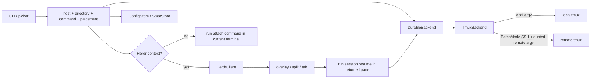
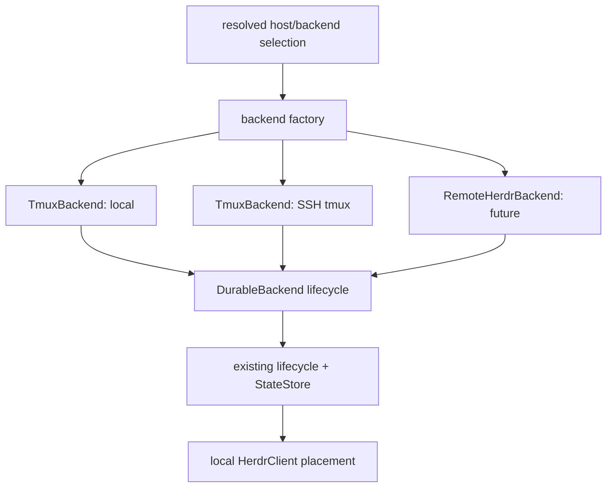

# Tether architecture

## Purpose and invariants

Tether makes the lifetime of a terminal workload independent of the Herdr pane or SSH connection viewing it. In v0.1 the durable unit is one exactly named `tmux` session. A pane is an attach client, not the workload owner.

The implementation preserves these invariants:

1. creating a workload precedes recording it as active;
2. a persistence failure after create triggers a best-effort close; if rollback also fails, the exact workload ID and both failures are reported;
3. attach/resume never closes a workload, including when attach fails or the connection drops;
4. only explicit close may invoke `kill-session`; before killing a running workload it persists a recoverable `closing` marker, then finalizes metadata only after the workload is proven missing or exact-session kill succeeds;
5. config and state mutations hold per-file advisory locks across load, mutation, and atomic save;
6. pruning removes only old closed metadata and never kills or probes workloads;
7. every `tmux` operation uses an exact session target derived from a generated Tether ID.

Version 0.1 remote support is ordinary OpenSSH transport to remote `tmux`. It is not native remote Herdr federation.

## Runtime flow



For `open`, the CLI resolves a host before creating or loading state when an explicit host was supplied. It obtains a complete selection from arguments or the picker, creates a new session through the backend, atomically saves an active `SessionRecord`, then attaches. In Herdr context, attachment is indirect: `HerdrClient` creates the requested pane and runs this executable's `session resume <ID>` command in that exact pane. Outside Herdr, the backend's attach command runs directly.

## Actual boundaries

### `DurableBackend`

`src/backend.rs` defines the transport-independent lifecycle contract:

```rust
trait DurableBackend {
    fn create(&self, launch: &LaunchSpec) -> Result<()>;
    fn inspect(&self, id: &SessionId) -> Result<WorkloadState>;
    fn attach_command(&self, id: &SessionId) -> Result<CommandSpec>;
    fn close(&self, id: &SessionId) -> Result<()>;
}
```

`LaunchSpec` carries the generated session ID, initial directory, and trusted shell command. `CommandSpec` preserves an executable and separated argv until a boundary requires a POSIX command line. `WorkloadState` distinguishes missing, running (with attached-client count), and indeterminate workloads.

This trait owns durable workload lifecycle only. It does not own configuration, state persistence, picker UI, pane placement, or host discovery.

### `TmuxBackend`

`src/tmux.rs` is the only v0.1 `DurableBackend` implementation. Its location is either local or one validated explicit SSH target.

Local operations execute `tmux` with separated argv. Remote operations build one POSIX-quoted remote `tmux` command and pass it to OpenSSH after `--`:

- create: detached `tmux new-session`, exact generated name, selected directory, then `/bin/sh -lc <command>`;
- inspect: exact-name-filtered `tmux list-sessions` output with the attached-client count;
- attach: `tmux attach-session` for the exact target;
- close: `tmux kill-session` for the exact target.

All SSH operations use `BatchMode=yes`. Interactive attach additionally requests a TTY. Server-alive probes are configured for backend operations; no setting weakens OpenSSH host-key verification. OpenSSH configuration, authentication, proxies, and `known_hosts` remain outside Tether.

The remote target validator prevents values that could become SSH options or shell syntax. The remote command builder POSIX-quotes every `tmux` argument. Session targeting uses `=<ID>` rather than a prefix.

### `HerdrClient`

`src/herdr.rs` is a local Herdr CLI adapter, not a durable backend. It consumes Herdr's executable, pane ID, and workspace ID from plugin context. It can:

- open a manifest-declared `picker` or `setup` plugin pane as an overlay;
- split and focus the invoking pane right or down;
- create a tab and extract its root pane ID;
- run one POSIX-quoted `CommandSpec` in the newly returned pane;
- validate Herdr's JSON result type and returned pane identity.

`HerdrClient` never creates, inspects, or kills the durable workload. Conversely, `TmuxBackend` knows nothing about Herdr panes. The CLI is the orchestration layer joining these boundaries.

### Configuration, state, and discovery

`ConfigStore` owns versioned TOML host, root, preset, and UI-default data. `StateStore` owns versioned JSON session records. `AppPaths` resolves plugin directories first and otherwise follows XDG/HOME defaults. Both stores use the shared atomic writer.

`sshcfg` discovers only literal OpenSSH `Host` aliases for picker/list use. OpenSSH itself still interprets the selected alias and the rest of its configuration. An alias is synthesized as an ephemeral host option; it is not copied into Tether config.

`State` is metadata, not a process registry. Each record retains the resolved target so removing a host configuration does not make an existing record unaddressable. Active records are not automatically reconciled when a workload vanishes.

## Picker and placement boundary

`PickerOptions` merges inputs with explicit precedence:

- local first when included;
- configured hosts and then discovered non-duplicate SSH aliases;
- recent session directories (newest use first), configured roots, then a local HOME or `~` fallback;
- built-in shell first, followed by configured presets;
- configured UI placement, split right by default.

The state machine is host → directory → command → placement. Cancellation returns no selection. It does not create a backend or save state. Partial CLI arguments constrain or override the corresponding picker result; a fully specified host/directory/command or preset bypasses the picker.

Placement is meaningful only when Herdr context is available. In an ordinary terminal the selected placement is recorded in the selection but attachment happens in that terminal. In Herdr, placement creates a transient split/tab and starts `session resume`; the backend workload is already durable before pane creation.

## Lifecycle and failure semantics

### Create

1. Resolve target and command.
2. Generate a UUID-v7-derived Tether session ID.
3. `DurableBackend::create` starts detached `tmux`.
4. Append active metadata and save it under the state-file advisory lock.
5. If save fails, best-effort `close` the just-created backend session. If rollback also fails, report both failures and the exact ID of the workload that may remain.
6. Attach directly or place a Herdr resume command.

A failure in step 6 leaves the workload and active metadata intact by design.

### Resume

Resume rejects unknown, closing, or closed records. Under the state-file lock it reconstructs a backend from the record's retained target and inspects the exact ID. Only `Running` is attachable; `Missing` and `Unknown` are explicit errors. The successful pre-attach path updates `last_used_at` and atomically saves it, releases the lock, then launches attach. A subsequent attach failure does not close or rewrite the record.

### Close

Close rejects unknown and already closed records and holds the state-file lock for the transition. A workload proven `Missing` is finalized closed without issuing `kill-session`; `Unknown` is retained unchanged. For a running workload, close first persists `Closing`, performs the exact-session kill, then persists `Closed` with `last_used_at` and `closed_at`. If kill or the final save fails, the durable `Closing` marker remains; a later `close` re-inspects and safely retries or finalizes the transition.

### Prune

Prune computes eligibility from record status, `closed_at`, current time, and retention (30 days by default). It intentionally supplies `Missing` for an already-closed record because explicit close either proved the workload absent or killed it successfully. It does not reconnect or inspect. Dry-run and real prune print the same eligible IDs; only real prune rewrites state. Active, unknown, and recent closed records are retained.

## Persistence and security

The storage layer creates parent directories and persistent sibling advisory-lock files, enforcing Unix mode `0700` on directories and `0600` on lock/data/temporary files. Mutating CLI operations serialize load → mutation → save under the per-file lock. The atomic writer writes and syncs a unique sibling temporary file, atomically renames it over the destination, then syncs the parent directory. Config/state validation occurs before save. Missing files yield empty current-version values; supported legacy version 0 data migrates on load.

Stored metadata includes targets and trusted preset names/commands in config plus session location/lifecycle data in state. It does not include SSH passwords, private keys, terminal contents, or telemetry identifiers. There is no telemetry subsystem.

Security is deliberately delegated at clear boundaries:

- OpenSSH owns authentication and strict host-key policy;
- Tether validates targets, preserves argv, and quotes at the remote shell/Herdr command-line boundaries;
- `tmux` owns workload durability;
- Herdr owns local plugin context and pane creation;
- `/bin/sh -lc` executes user-configured commands, which are trusted code rather than sandboxed data.

## Capability evidence and manual boundaries

Automated tests exercise command parsing and state behavior, config migration/private writes, concurrent state transactions, host discovery and validation, local/remote backend argv and exact targeting, lifecycle cleanup eligibility and recoverable close failure paths, adversarial POSIX quoting, Herdr response parsing/focused placement, picker transitions/cancellation, and manifest shape. The current run reported 36 passing tests and a locked release build.

Live verification covered Herdr 0.7.3 development link, action list, and unlink. A strict-BatchMode SSH run from Hermes to `dev` exercised remote create, real-TTY attach, detach, same-PID counter continuity, resume, exact close, and prune isolation with an unrelated `tmux` session retained.

The same run verified a directory containing spaces and literal shell metacharacters without creating an injected sentinel. A separate real-TTY run on Hermes verified the equivalent local create/attach/detach/resume/close lifecycle and unrelated-session isolation. Native Herdr action/overlay interaction, all three placements with mixed local/remote panes, picker Esc state immutability, setup's non-modification of Herdr config, and macOS live lifecycle remain acceptance checks. CI runs the complete Rust gates on Ubuntu 24.04 and macOS 14. Reproducible steps are maintained in the README's **Independent Hermes verification** section.

## Future native federation path

A future `RemoteHerdrBackend` should implement `DurableBackend`; it should not grow transport conditionals inside `HerdrClient` or replace state persistence with pane state. That backend would translate the same create/inspect/attach-command/close lifecycle into authenticated remote Herdr operations. Native federation additionally requires contracts that v0.1 does not have:

- remote Herdr identity and trust establishment;
- capability/version negotiation;
- stable remote workload and workspace identifiers;
- attachment semantics that can still produce a local `CommandSpec` or a deliberately revised backend interface;
- precise timeout, partition, retry, and idempotency behavior;
- reconciliation rules for local metadata versus remote truth.

The likely selection/orchestration shape is:



No `RemoteHerdrBackend` exists today. Naming it here is an architectural path, not a compatibility or delivery promise.

## Roadmap

1. Complete native Herdr placement, cancellation/config-integrity, and macOS live acceptance checks.
2. Define native federation identity, capabilities, lifecycle, and failure semantics before changing the backend trait.
3. Implement and test `RemoteHerdrBackend` only after those contracts are stable.
4. Add explicit operator-driven reconciliation for missing active workloads without weakening conservative pruning.
5. Expand release/distribution and Linux/macOS live matrices.

## Design influence

`herdr-mirror` v0.1.6, licensed MIT, was inspected as an influence on the problem space. Tether does not copy its topology or code; the `DurableBackend`/`TmuxBackend`/`HerdrClient` separation described above is this project's implementation.
