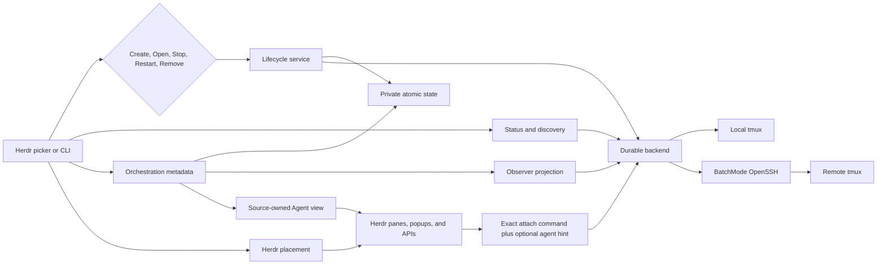

# Architecture and security

Tether makes a terminal workload outlive any one Herdr view or SSH connection. Herdr owns panes and tabs, `tmux` owns durable execution, OpenSSH owns remote transport, and Tether owns exact workload identity plus lifecycle metadata.

The public mental model is documented in [Lifecycle](lifecycle.md). This document describes the implementation and trust boundaries behind it.

## System overview

The boundaries are intentionally one-way:

- status and discovery may observe, but cannot authorize destructive work;
- Herdr placement may display or attach, but cannot change workload ownership;
- external session discovery produces an attach-only type with no lifecycle methods;
- metadata cleanup has no SSH, `tmux`, probe, or Stop capability.
- Agent view filters, labels, and tokens are presentation metadata; they cannot authorize capture, input, or lifecycle work.

## Core invariants

1. Closing or losing a view never stops a workload.
2. Only an explicit confirmed Stop may end a running Tether-owned workload.
3. Open attaches only to an exact workload proven running.
4. Ended work is never offered as a running attachment; Restart creates a safe new identity from retained launch data.
5. Remove and automatic cleanup affect only metadata already proven safe to finalize.
6. Unknown or unreachable is not treated as dead.
7. External `tmux` sessions are validated, exact-name, attach-only resources.
8. Mutating configuration and state migrations occur under the same private lock and atomic-write rules as ordinary mutations; snapshot observation migrates legacy data in memory without rewriting its files.

## Opt-in orchestration groups

State schema version 4 stores an `orchestration_groups` collection and a unique
membership epoch for every worker entry. Schemas 0 through 2 migrate with an
empty collection, so no session is grouped implicitly. Schema version 3 groups
migrate by assigning and persisting fresh membership epochs. Each group stores
a bounded, harness-neutral ID and title,
one exact orchestrator session reference, and an ordered worker-membership
list. Each worker stores its opaque epoch, an exact session reference, an
optional display title, and three independent capabilities:

- `observe_output` authorizes bounded output observation;
- `open_interactive` authorizes opening that worker from Observer; and
- `prompt_agent` authorizes a reviewed Herdr agent prompt only after every
  Mission Control authority check succeeds.

`prompt_agent` is additive and defaults to `false` when absent, so existing
schema-v4 files remain valid. A worker must have
at least one capability. The orchestrator reference records the coordinating
role but grants no lifecycle, capture, or input authority. Creating or deleting
a group and adding or removing a worker mutate only group metadata: they never
create, adopt, stop, remove, or send input to a session.
State admits at most 32 groups and 64 workers per group. Identifiers and titles
are validated and bounded; references carry no host, path, command, or
orchestration-runtime assumptions.

The native picker exposes groups through a harness-neutral manager projection.
It derives bounded labels from safe host, repository, and preset metadata,
persists create/edit/delete requests through `OrchestrationService`,
and re-reads authoritative state after each mutation. UI defaults grant both
bounded observation and interactive open to selected workers. The manager never
renders full raw session IDs: only ambiguous safe labels receive bounded opaque
collision references. It never calls workload lifecycle methods. The standalone
CLI uses the same service and remains an optional adapter API.
Every new orchestrator or worker admission revalidates that session as a
currently running exact-owned workload while holding the state lock, including
optional CLI adapter operations. Manager edits permit already-retained
unavailable members. Worker-edit, reassignment, and delete actions carry the
complete topology snapshot displayed to the user and reject under the lock if
its title, orchestrator, membership order, membership epoch, capabilities, or
worker titles changed before commit. Promoting a worker to orchestrator removes
that worker role while preserving every unaffected membership.

## Native Agent views

Herdr can project one orchestration group into the native
Agents sidebar. The user explicitly selects all group agents, agents needing
attention (`blocked` or `done`), or remote group agents; Tether never installs
a view implicitly. `AgentViewService` persists only the selected group ID and
view mode in bounded `agent-view.json` beside `state.json`, then installs one
transient view owned by source `plugin:moneycaringcoder.tether`. Filters combine
Herdr's status with bounded `tether_group` and `tether_remote` tokens and apply
only to Herdr-recognized agent panes.

When Tether opens an owned session that belongs to the selected group, it
reports the group and remote-origin tokens on the newly placed pane. Exact
Mission Control members also receive session and membership-epoch tokens. The
tokens and view are display-only: group membership remains in `state.json`,
and lifecycle, observation, and interactive-open authority continue to require
the ordinary exact-owned state and capability checks.

Set and clear operations hold the preference lock, persist the desired value,
and roll it back if Herdr rejects the corresponding socket request. Deleting
the selected group first clears the view; a rejected group deletion attempts
to restore it. A startup hook restores a valid preference after Herdr startup
or live handoff and drops a preference whose group no longer exists.

## Observer and Mission Control projection

`orchestration observe` creates exactly one outer Herdr pane. Every exactly
bound recognized agent uses event-driven status. `observe_output`
authorizes `agent.read` and semantic wait, while `open_interactive` authorizes
focus/open. The independent `prompt_agent` grant alone enables prompt
selection and delivery; read/open capabilities never imply it. The manager
offers that grant only when a Herdr session is reachable and the durable
session has an explicit Herdr agent hint. Removing a grant remains possible while
Herdr is unavailable.

The view projects at most four workers per deterministic row-major page. One
tile uses the full canvas, two divide it side by side, and three or four use a
2×2 grid. Additional workers remain in membership order. Geometry, text,
capture lines, bytes, display cells, group count, worker count, and prompt
target count are all bounded. Untrusted titles, timestamps, notices, and output
are sanitized before rendering.

### State and observation

Durable lifecycle and group metadata remain authoritative in `state.json`.
Mission Control adds a typed, bounded `HerdrSocketClient` for:

- `session.snapshot` and reconnecting `events.subscribe`;
- `agent.read`, `agent.focus`, and semantic `agent.wait`;
- pane metadata reports; and
- one atomic `agent.prompt` plus `agent.wait` delivery.

The event monitor reports a mandatory resnapshot after initial connection and
every reconnect. Agent status events update the control room without recurring
SSH capture processes. Workers that are not attached as recognized Herdr
agents keep the existing adaptive local/SSH `tmux` capture fallback. A periodic
resnapshot remains a recovery boundary for pane moves and dropped events.
Each exact snapshot or successful fallback capture records its bounded
round-trip latency. Failed captures do not publish time-to-error as healthy
latency.

Tiles distinguish `DETACHED`, `IDLE`, `WORKING`, `BLOCKED`, `DONE`, `UNKNOWN`,
`UNREACHABLE`, and `STALE`. A socket or SSH loss never fabricates completion:
the last known capture, observation time, and status are retained as `STALE`,
agent input is disabled, and destructive actions remain absent. A successful
resnapshot restores the live state. Closing the view drops only the presentation
and event subscription; durable Tether workloads continue running.

A recognized agent's tile also carries a bounded output sample, fetched through
the same typed `agent.read` request the explicit read uses, with a small line
count. It is taken on its own thread, so a slow socket delays a sample instead of
blocking the surface, and it is requested when a tile first appears, when Herdr
reports that worker's state changed, or when the sample on screen has aged past a
fixed window - never on the refresh timer. Cost is therefore proportional to
reported change and capped by the visible page. A sample is marked as one in both
the tile body and the border title, so a narrow or short tile cannot present it as
a complete read; Herdr's `truncated` flag is carried through so a clipped sample
says both things. It is subject to the same sanitization and display bounds as any
capture, is never persisted, and is never read back to derive state: the agent
state on a tile comes from the typed snapshot and the event stream, never from
terminal output.

Fallback capture still requires the exact membership epoch, `observe_output`,
running status, ownership proof, and exact internal `tmux` identity. Tether
captures only the visible fallback workers, checks the complete authorization
fingerprint again after each asynchronous result, strips terminal escape
sequences, and caps each capture at 200 logical lines, 16 KiB, and 16,384
display cells.

### Exact group-member binding

When Mission Control opens a group member, Tether reports bounded
`tether_group`, `tether_session`, `tether_membership`, and `tether_remote`
metadata on the new Herdr pane. The membership token is the persisted unique
membership epoch. Exact binding matches the group, session, and membership
values, then requires the recognized agent kind to match the immutable
session's explicit Herdr agent hint.

Missing, ambiguous, stale, replaced, unknown, or unverified moved occupants
fail closed. A pane move remains valid only when the same recognized
terminal/name/kind identity remains bound. Metadata tokens are not authority by
themselves: Tether also revalidates the current state capability, membership
epoch, exact ownership, running state, and live Herdr occupant. Ordinary
`Enter` open keeps its separate `open_interactive` and exact-owned lifecycle
gate.

### Reviewed one-shot prompt delivery

`Space` selects at most eight prompt destinations and `p` opens a review flow.
The prompt is held in memory only. The user sees the exact destination IDs and
sanitized prompt and must type `SEND`; cancellation sends nothing.

Immediately before each delivery, Tether reloads state, resolves the pane
binding twice, requires `prompt_agent`, exact ownership, running state, the
expected agent kind, and settled `IDLE` or `DONE` state, then calls Herdr's
atomic prompt-and-wait operation once. `WORKING`, `BLOCKED`, `UNKNOWN`,
`UNREACHABLE`, and `STALE` targets reject input. Multi-target fan-out reports
each destination independently. A confirmed pre-delivery rejection is
`REJECTED`. A prompt Herdr wrote to the agent that then produced no observed
state change is `DELIVERED→NO CHANGE`: delivery is certain, only the reaction is
missing, so it must not read as a candidate for resending. A timeout or
connection loss after the call begins is `UNCERTAIN` and is never retried
automatically because delivery may already have occurred.
Partial success is shown explicitly and cannot be rolled back.

`f`, `v`, `w`, and `e` use the same exact current binding. Focus requires
`open_interactive`; read, semantic wait, and explain require `observe_output`.
None of those capabilities implies `prompt_agent`. `e` relays Herdr's own
`agent.explain` payload; because that payload is an open object, Tether
flattens only its top-level scalars into bounded, sanitized pairs and reports
collections by shape rather than dumping them. A read Herdr marks truncated
renders as `TRUNCATED` so a clipped capture is never mistaken for the worker's
complete output. Mission Control never exposes Stop,
Restart, Remove, arbitrary shell, raw terminal bytes, synthesized Enter, or
unattended retry. Prompt permission cannot authorize lifecycle mutation.

### Placement and teardown

Opening a worker normalizes `replace-current-pane` to `split-right`, preserving
Mission Control. Queued `Enter` presses are debounced so one gesture cannot
create duplicate panes. Native manager launch requires the current
`HERDR_PLUGIN_CONTEXT_JSON.focused_pane_id`; nested Tether workloads must hand
placement back to an actual Herdr pane. Terminal teardown independently
restores cursor visibility, leaves the alternate screen, and disables raw mode
on every guarded exit path.

## Durable workload backend

`DurableBackend` is transport-independent. Its implementation creates, observes, attaches to, and stops exact Tether-owned workloads. `TmuxBackend` supplies local and SSH-backed behavior without knowing about Herdr panes or picker state.

Local operations preserve argv. Remote operations build a POSIX-quoted remote
`tmux` command and pass it to OpenSSH after `--`. Every remote operation uses
`BatchMode=yes`, a bounded connection timeout, server-alive checks, and
OpenSSH-native connection reuse (`ControlMaster=auto`, `ControlPersist=60`,
and a `%C` control path under `~/.ssh`). Tether does not weaken strict host-key
verification or replace OpenSSH configuration.

Creation:

1. generates a reserved Tether identity;
2. starts a detached `tmux` session in the selected directory;
3. captures `tmux`'s internal session and pane identities;
4. verifies the pane's exact working directory (or same directory inode);
5. enables mouse support only on the exact owned session; and
6. records metadata only after backend creation succeeds.

A verification or persistence failure triggers best-effort rollback through the captured internal identity. If rollback also fails, the error identifies the exact workload that may remain without exposing command output.

Literal remote `~` and `~/...` paths expand in the remote login environment before directory restoration and verification. The selected command then runs as trusted code through the selected machine's shell.

## Observation and ended processes

Tether makes one bounded, non-destructive catalog observation per host and derives both owned and external rows from it. Probes have deadlines, output caps, cancellation, and child-process-group cleanup. One slow host does not block completed hosts.

For owned work, observation prefers native `tmux` evidence such as `remain-on-exit`, `pane_dead`, and pane exit status when supported. This distinguishes:

- a process that is still running;
- a process that ended with available exit context;
- an exact identity proven missing; and
- an observation that is unreachable or structurally unknown.

Missing and ended identities are not attachable. Cached picker status is display data only; Stop, Restart, and Remove revalidate the authoritative record and the evidence required by their operation.

External catalog rows are validated printable names outside the reserved `tether-*` namespace. They can produce an exact attach command, but no external type can be converted into a create, persist, rename, Stop, Remove, or cleanup request.

## Lifecycle transactions

### Create

Tether creates the backend workload before recording it as running. If state persistence fails, it attempts exact rollback. Placement failure also rolls back a newly created workload and metadata so retry cannot silently duplicate it.

### Open

Open loads the exact persisted host and identity, observes it, and attaches only when it is running. It updates use metadata atomically before launching the attach client. A later attach or placement failure leaves the workload untouched.

### Stop

Stop is explicit and confirmed. Tether observes the exact owned identity without holding the state-file lock, revalidates the unchanged record under a short lock, and persists a recoverable stopping transition before invoking exact backend termination. It finalizes the record only after the workload is proven missing or the exact Stop succeeds.

Timeout, transport failure, save failure, or concurrent change never masquerades as success. If exact termination succeeds but final persistence fails, the retained stopping transition exposes an actionable finalization retry. Reconciliation proves the backend is already absent and never sends a second kill.

### Restart

Restart is available only for an ended or proven-missing owned record. It retains the original command and directory, allocates a safe new execution identity, and commits the identity/state transition atomically. Persistence, transport, or placement failure remains recoverable and does not expose the old ended identity as running.

### Remove and retention

Remove finalizes metadata only for ended or proven-missing work. In the same locked transaction it removes matching worker memberships and removes a group whose orchestrator metadata was deleted; unrelated group order and metadata remain unchanged. Automatic retention cleanup applies the same reconciliation and removes only safely finalized metadata after the configured period. Cleanup does not construct a backend and cannot contact a host or stop a process.

When a cleanup operation works from a preview, it revalidates the exact unchanged candidate set under one lock. It never expands to records that became eligible after the preview began.

## Persistence

`ConfigStore` owns validated TOML. `StateStore` owns lifecycle and orchestration
records. `AgentViewService` owns one bounded JSON presentation preference.
All three apply finite input and field-size budgets before serialization or
follow-on work. Their parent directories, persistent lock files, data, and
temporary files use private Unix permissions. Mutations hold a per-file
advisory lock across load, validation, migration or preference checks,
mutation, and save.

Before locking, storage resolves one existing regular-file identity, including
supported file or parent-directory links. The resolved path names both the lock
and every transaction read, backup, permission, and write operation. Existing
non-regular or dangling targets fail before a blocking reader opens them.
Tether secures its original non-linked private parent, and privatizes any
parent directory it creates itself, linked ancestors included. Only an already
existing linked target parent keeps its own permissions. Resolution necessarily
precedes the lock; because storage lives in the caller's own private tree, a
link replaced in that window is an ordering concern rather than a trust
boundary.
Persistent `.filename.lock` files and Herdr keybinding backups are siblings of
that resolved target. A Stow-managed repository can ignore those generated
sidecars without changing Tether's storage identity.

The atomic writer:

1. follows supported links to the resolved regular destination and rejects
   dangling or non-regular targets;
2. writes and synchronizes a unique sibling temporary file beside that resolved
   destination;
3. preserves an existing regular destination's permission bits, or uses mode
   `0600` for a new private file;
4. atomically renames it over the destination; and
5. synchronizes the parent directory.

Supported older schemas migrate inside the lock. Corrupt data, over-budget data,
unknown fields where strict schemas apply, and future versions fail closed.
State is metadata, not a process registry; destructive safety comes from fresh
exact backend evidence, not the presence or absence of a JSON record.

Stored data may include host targets, directories, trusted preset commands,
explicit agent kinds, owned identifiers, launch information, lifecycle status,
orchestration metadata, one selected Agent view group and filter mode, exit
context, and timestamps. Tether does not store SSH passwords, private keys,
access tokens, terminal contents, or telemetry identifiers.

## Discovery and snapshots

Repository discovery uses one whole-request deadline plus global entry, result,
message, worker, and cancellation budgets across every configured location.
Completion reports whether the request completed, reached a budget/deadline, or
was cancelled; stable request and lexical ordering survive truncation. Local
traversal does not follow symlinks. Remote traversal uses a fixed portable
scanner through validated BatchMode SSH.

Literal OpenSSH aliases are parsed from the primary config and bounded,
cycle-safe `Include` files whose canonical paths remain beneath its directory.
Wildcard `Host` patterns and escaping includes are ignored. Status requests
reject over-budget input and deduplicate exact targets before bounded
classification. Discovery and
status results are presentation data and never rewrite configured roots or
lifecycle state.

The scriptable snapshot joins effective hosts, bounded repository discovery, complete owned metadata, live owned status, and safe external catalogs. Expected degradation is represented as typed partial data instead of a fabricated empty result. Snapshot has no lifecycle or persistence-mutation capability and excludes preset command bodies, child output, raw backend errors, and private storage paths.

## Public quality gates

Release-candidate validation is package-derived rather than based on a hand-maintained file list. The package checker enforces archive member, compressed, and uncompressed size budgets before extracting into an isolated directory, installs that exact source package, and exercises non-mutating help plus setup, doctor, and snapshot contracts in isolated user paths. Documentation links, anchors, traversal safety, canonical defaults, and version references are checked deterministically. Packaged public text and curated non-mutating CLI examples are scanned and executed with bounded, redacted diagnostics. The live product smoke can emit a versioned bounded JSON record of phases, exercised actions and placements, cleanup, and tool versions.

## Herdr placement boundary

`HerdrClient` adapts Herdr's pane, tab, plugin-surface, and metadata commands.
Managed picker/setup surfaces are session-modal popups declared directly in
the plugin manifest, so no runtime capability probe runs. Tether captures the
invoking pane, creates and focuses the selected split or tab, then runs an
exact Tether attach command there. It uses its resolved executable and forwards
Herdr's authoritative plugin config/state directories instead of relying on a
pane-local `PATH`.

The main setup command probes Herdr, `tmux`, and OpenSSH through fixed version
arguments before creating or rewriting Tether state or configuration. The
separate keybinding command verifies Herdr before touching Herdr configuration
or backups. Cargo remains an installation/build prerequisite rather than a
runtime setup dependency.

The picker consumes only Herdr's documented optional `focused_pane_cwd` and
`workspace_cwd` context fields, with pane context taking precedence. A match
can stably reorder existing authorized picker entries; unknown, malformed, or
multi-host ambiguous paths are ignored and never become new configuration or
selection data. Plugin-managed failures cross one redaction boundary: raw
error chains stay out of action logs, while a bounded validated
`correlation_id` remains available for support.

The official-Herdr product smoke drives the installed `prefix+t` action through
Herdr's PTY at 80×24 and 48×14, verifies semantic picker transitions using only
keyboard input, and restores the default test viewport before lifecycle checks.

Replace current pane follows destination-first ordering:

1. inspect foreground processes in the captured source;
2. request confirmation when replacement could terminate them;
3. create a destination;
4. dispatch the exact attachment;
5. wait for the strongest readiness signal Herdr exposes; and
6. only then close the captured source.

Cancellation, dispatch failure, or readiness failure preserves the source. A final source-close failure preserves the verified destination and reports both pane identities.

An explicit validated agent hint can expose a supported agent hidden behind SSH
or `tmux`, and an opt-in source-owned view can filter recognized group panes.
A workload with no hint keeps clear pane/session titles.
Tether still never infers an arbitrary agent identity or lifecycle from a
command or process title.

## Threat model and trust boundary

The trusted computing base includes:

- the local user account and filesystem;
- installed Tether, Herdr, Git, Rust/Cargo, `ssh`, `tmux`, and `/bin/sh` executables;
- Tether configuration and command presets;
- OpenSSH configuration, keys, agent, proxies, and `known_hosts`; and
- each selected remote host and user account.

Tether does not sandbox commands, secure a compromised endpoint, configure SSH trust, rotate credentials, or replace host authorization. It does:

- validate SSH targets and external session names;
- preserve argv and quote only at unavoidable command-line boundaries;
- use exact owned `tmux` identities for lifecycle actions;
- reserve its ownership namespace;
- bound probes and scanners;
- keep lifecycle transitions recoverable;
- use private atomic persistence; and
- keep destructive capability out of observation, external attachment, and cleanup paths.

For operational settings, see [Configuration](configuration.md). Report suspected vulnerabilities through the [security policy](../SECURITY.md).
